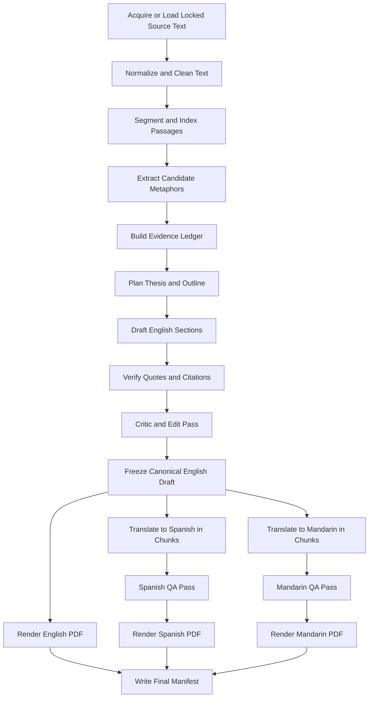

# Agent Gatsby
## Local, Citation-Verified Literary Analysis and Translation Pipeline

Agent Gatsby is a local-first, deterministic, evidence-led AI system for producing a literary analysis of *The Great Gatsby* and generating three submission-ready PDF artifacts:

1. **English analysis**
2. **Spanish translation**
3. **Mandarin translation (Simplified Chinese)**

This repository is intentionally designed to demonstrate more than prompt-writing. It is meant to show the ability to **engineer, implement, test, verify, and package an AI-enabled system** that can run in a constrained local environment with explicit controls around evidence, citations, translation fidelity, and artifact generation.

The central design decision in this repository is simple:

> **Do not treat a large context window as a substitute for system design.**
>  
> Instead, treat the model as one component inside a controlled pipeline with explicit state, verification gates, and deterministic artifact generation.

---

## Table of Contents

- [1. Project Objective](#1-project-objective)
- [2. Why This Architecture Exists](#2-why-this-architecture-exists)
- [3. Core Design Principles](#3-core-design-principles)
- [4. What This System Is Not](#4-what-this-system-is-not)
- [5. High-Level Architecture](#5-high-level-architecture)
- [6. End-to-End Workflow](#6-end-to-end-workflow)
- [7. Repository Structure](#7-repository-structure)
- [8. Data Contracts and Intermediate Artifacts](#8-data-contracts-and-intermediate-artifacts)
- [9. Orchestration Strategy](#9-orchestration-strategy)
- [10. Model Strategy](#10-model-strategy)
- [11. Prompting Strategy](#11-prompting-strategy)
- [12. Verification and Quality Gates](#12-verification-and-quality-gates)
- [13. Translation Strategy](#13-translation-strategy)
- [14. PDF Rendering Strategy](#14-pdf-rendering-strategy)
- [15. Reproducibility and Auditability](#15-reproducibility-and-auditability)
- [16. Logging, Error Handling, and Recovery](#16-logging-error-handling-and-recovery)
- [17. Testing Strategy](#17-testing-strategy)
- [18. Configuration](#18-configuration)
- [19. Cold-Start Execution](#19-cold-start-execution)
- [20. Why This Approach Is Stronger Than a One-Shot Prompt](#20-why-this-approach-is-stronger-than-a-one-shot-prompt)
- [21. Known Risks and Mitigations](#21-known-risks-and-mitigations)
- [22. Future Enhancements](#22-future-enhancements)

---

## 1. Project Objective

The objective of Agent Gatsby is to take a locked source text of *The Great Gatsby* and produce a submission package that satisfies the following output requirements:

- a polished **English literary analysis of the novel’s major recurring metaphor systems, including citations**, targeting approximately 10 pages and operationalized as roughly 2800-3200 words at an estimate of about 280 words per page
- a **Spanish translation** of that analysis
- a **Mandarin translation** of that analysis, rendered in Simplified Chinese
- three separate, professional **PDF artifacts** suitable for upload

This repository does **not** optimize for maximal autonomy or novelty. It optimizes for:

- **accuracy**
- **traceability**
- **reproducibility**
- **clean local execution**
- **explicit evidence grounding**
- **high-quality final artifacts**

---

## 2. Why This Architecture Exists

A naive implementation of this assignment would do the following:

1. load the entire novel into a long-context model
2. ask for a 10-page metaphor analysis with citations
3. translate the result twice
4. export three PDFs

That approach is fast, but it is brittle.

The most common failure modes of that approach are:

- invented or imprecise citations
- paraphrases disguised as direct quotations
- weak linkage between argument and evidence
- inconsistent metaphor selection across sections
- translation drift
- broken typography in CJK PDF output
- poor reproducibility
- no meaningful verification layer

Agent Gatsby exists to solve those problems by replacing a one-shot generation pattern with a **controlled multi-stage pipeline**.

---

## 3. Core Design Principles

### 3.1 Local-First Execution
The entire pipeline is designed to run locally on a single workstation. No external inference APIs are required for the reference implementation.

### 3.2 Explicit State Over Hidden Agent Magic
State is stored as structured artifacts on disk. The system does not rely on opaque chain-of-thought persistence, hidden session state, or orchestration wrappers that conceal intermediate decisions.

### 3.3 Evidence Before Prose
The model does not write the final essay first. It first identifies candidate metaphors, extracts evidence, and builds an **evidence ledger**. The essay is then generated from that ledger.

### 3.4 Verification Before Promotion
A stage is not considered complete merely because the model produced output. A stage is promoted only if it passes validation checks.

### 3.5 Deterministic Artifact Generation
The model produces structured content. A deterministic renderer produces the final PDFs. The model is not responsible for layout.

### 3.6 Reproducible Inputs
The system uses a locked text source and records hashes, prompts, configuration, and output manifests.

### 3.7 Minimum Viable Complexity
The pipeline intentionally avoids unnecessary abstraction layers. No LangChain or LangGraph is required. Orchestration is handled by a plain Python state machine and explicit module boundaries.

---

## 4. What This System Is Not

Agent Gatsby is **not**:

- a one-prompt demo
- a benchmark for general literary theory
- a generic autonomous agent platform
- a chain-of-thought visualizer
- a human replacement for literary scholarship
- a weekend attempt to train a custom metaphor classifier or build a labeled metaphor dataset from scratch

It is a **production-minded local AI pipeline** built for a concrete deliverable.

---

## 5. High-Level Architecture



At a high level, the system is divided into seven logical layers:

1. **Source acquisition and locking**
2. **Text normalization and indexing**
3. **Metaphor candidate extraction**
4. **Evidence ledger construction**
5. **English composition and verification**
6. **Translation and bilingual QA**
7. **Deterministic PDF rendering**

---

## 6. End-to-End Workflow

## 6.1 Stage 0: Source Acquisition and Edition Locking

The pipeline begins with a source text for *The Great Gatsby*.

### Goals
- ensure the text is stable
- prevent citation drift across runs
- record a reproducible source fingerprint

### Design Choice
The canonical run should **not** depend on a live network fetch at execution time.

### Preferred Strategy
- keep a cached UTF-8 source file in `/data/source/`
- record the file's `sha256` in a manifest
- optionally support a one-time bootstrap fetch script
- strip boilerplate once and persist the normalized file for future runs

### Why this matters
If a reviewer reruns the pipeline, the source should not silently change. Reproducibility is stronger when the exact text used for the analysis is fixed and hashed.

---

## 6.2 Stage 1: Normalization

The raw source is normalized into a canonical internal representation.

### Responsibilities
- remove boilerplate
- normalize line breaks
- normalize whitespace
- preserve paragraph boundaries
- preserve chapter boundaries
- assign stable passage identifiers

### Example output artifact
`data/normalized/gatsby_locked.txt`

### Example derived metadata
`artifacts/manifests/source_manifest.json`

```json
{
  "source_name": "gatsby_locked",
  "encoding": "utf-8",
  "sha256": "REDACTED_HASH",
  "chapter_count": 9,
  "paragraph_count": 742,
  "generated_at": "2026-04-16T12:00:00Z"
}
```

---

## 6.3 Stage 2: Passage Segmentation and Indexing

The normalized source is segmented into passages to support retrieval, verification, and citation mapping.

### Responsibilities
- split text by chapter
- split chapters into paragraphs
- assign stable IDs such as `3.14` for chapter 3, paragraph 14
- build lexical and optional semantic indices
- preserve exact raw passage text

### Why this matters
The model can reason over the full text if needed, but verification should operate over **addressable passages**, not over an undifferentiated string blob.

### Example passage record
```json
{
  "passage_id": "5.18",
  "chapter": 5,
  "paragraph": 18,
  "text": "There must have been moments even that afternoon when Daisy tumbled short of his dreams...",
  "char_start": 48213,
  "char_end": 48341
}
```

### Citation convention
The internal drafting and verification pipeline uses canonical bracketed chapter.paragraph locators such as `[5.18]`.

The final English report renders those deterministically as simple numbered note citations such as `[1]`.

The exact locked-source passages for those note numbers are written to a separate `Citation Text` artifact so the essay stays readable while the evidence remains auditable. A machine-readable citation registry is also written separately for QA.

---

## 6.4 Stage 3: Candidate Metaphor Extraction

This stage uses the local model to propose metaphor candidates before any essay drafting occurs.

### Responsibilities
- scan the text for metaphorically significant passages
- identify candidate images, symbols, and recurring figurative patterns
- output structured candidate records
- avoid writing the essay at this stage

### Why this matters
Separating extraction from drafting reduces the chance that the system invents evidence merely to support a predetermined thesis.

### Example output artifact
`artifacts/evidence/metaphor_candidates.json`

```json
[
  {
    "candidate_id": "C001",
    "label": "green light",
    "passage_id": "1.79",
    "quote_span": "the green light, minute and far away",
    "type": "recurring image",
    "notes": "Possible metaphor for desire, aspiration, and future-oriented longing",
    "confidence": 0.93
  }
]
```

---

## 6.5 Stage 4: Evidence Ledger Construction

This is the most important stage in the system.

The evidence ledger is the bridge between raw text and final analysis. It is the structured record that binds interpretive claims to exact textual evidence.

### Responsibilities
- promote validated candidates into formal evidence entries
- store exact quote text
- store stable passage locators
- store an interpretive note
- store confidence and status
- reject ambiguous or weak candidates

### Why this matters
The final essay should be written from a ledger of evidence, not from unconstrained recollection.

### Current build targets
- aim for roughly 15-20 verified evidence records before freezing the English master
- spread evidence across multiple chapters instead of clustering only in early passages
- require one human review of promoted metaphor records because v1 does not use a trained metaphor classifier

### Example output artifact
`artifacts/evidence/evidence_ledger.json`

```json
[
  {
    "evidence_id": "E001",
    "metaphor": "green light",
    "quote": "Gatsby believed in the green light, the orgastic future that year by year recedes before us.",
    "passage_id": "9.57",
    "chapter": 9,
    "interpretation": "The green light functions as a metaphor for future-oriented longing, self-projection, and the unattainability of idealized desire.",
    "supporting_theme_tags": [
      "aspiration",
      "idealism",
      "distance",
      "American Dream"
    ],
    "status": "verified"
  }
]
```

### Promotion rule
A candidate is only promoted if:
- the quote exists exactly in the source
- the passage ID resolves
- the claim is interpretable as metaphor or a metaphor-adjacent symbolic image
- the quotation is substantial enough to support analysis

### v1 override policy
If automated extraction misses an essential metaphor, a human may add a very small number of evidence entries directly to the verified ledger.

Any override must be explicit, reviewable, and logged in the run artifacts. This is a fallback, not a parallel evidence system.

---

## 6.6 Stage 5: Thesis Planning and Outline Generation

Only after the evidence ledger exists does the system plan the essay.

### Responsibilities
- identify strongest evidence clusters
- propose a thesis
- organize body sections
- assign evidence IDs to sections
- plan introduction and conclusion around actual evidence

### Why this matters
This prevents the essay from wandering into generic, unsupported literary filler.

### Example output artifact
`artifacts/drafts/outline.json`

```json
{
  "title": "Metaphor and the Architecture of Desire in The Great Gatsby",
  "thesis": "Fitzgerald's metaphoric language converts aspiration into distance, wealth into illusion, and memory into a structure of longing that ultimately collapses under its own idealization.",
  "sections": [
    {
      "section_id": "S1",
      "heading": "The Green Light and Deferred Aspiration",
      "evidence_ids": ["E001", "E004", "E009"]
    },
    {
      "section_id": "S2",
      "heading": "The Valley of Ashes as Moral and Social Metaphor",
      "evidence_ids": ["E002", "E006"]
    }
  ]
}
```

---

## 6.7 Stage 6: English Section Drafting

The system drafts the essay section by section rather than in one monolithic pass.

### Responsibilities
- draft one section at a time
- restrict each section to a bounded evidence set
- maintain a formal analytical tone
- preserve citation markers
- avoid unsupported claims
- ground each interpretation in surrounding locked-source paragraphs, not just an isolated quote

### Why this matters
Section-bounded drafting produces better local coherence and makes debugging easier.

### Drafting constraints
- every analytical paragraph must map to evidence IDs
- every direct quote must exist in the ledger
- every citation must resolve to a passage ID
- unsupported thematic claims are disallowed
- metaphor interpretation should explain what is happening in the scene and why the figurative language makes sense in the surrounding text
- claims about later developments should be tied to supporting evidence rather than vague story memory
- the English report should use a plain assignment-friendly title such as `An Analysis of Metaphors in The Great Gatsby`
- the introduction should briefly explain the story, explain metaphor as a literary device, and state that the selected number of metaphors was chosen to fit the target page length while remaining expandable
- each body section should present the metaphor text explicitly before the analysis

### Length targets
- target roughly 2800-3200 words for the English essay
- estimate page count using about 280 words per page as a planning heuristic, not as a formatting guarantee
- do not freeze the English master until both evidence breadth and draft length are in a credible range for the assignment

### Example output artifact
`artifacts/drafts/analysis_english_draft.md`

---

## 6.8 Stage 7: Citation and Quote Verification

After the English draft is generated, a deterministic verifier checks every quote and locator.

### Responsibilities
- ensure quoted text is an exact substring of the locked source
- ensure cited passage IDs exist
- ensure every citation in the draft maps to a ledger entry
- ensure no quote has been silently altered
- generate a machine-readable citation registry for the report
- report draft word count and estimated page count
- keep invalid quote rate at zero
- keep invalid citation rate at zero
- treat unsupported-claim ratio as an advisory human-review metric rather than a substitute for deterministic verification

### Why this matters
A literary essay with weak citations fails the core deliverable.

### Example output artifact
`artifacts/qa/english_verification_report.json`

Additional QA artifact:
`artifacts/qa/citation_registry.json`

```json
{
  "quote_checks_total": 24,
  "quote_checks_passed": 24,
  "citation_checks_total": 24,
  "citation_checks_passed": 24,
  "issues": []
}
```

---

## 6.9 Stage 8: Critic Pass and Editorial Polish

Once the draft is verified, the system runs a critic/editor stage.

### Responsibilities
- improve transitions
- remove repetition
- sharpen topic sentences
- improve academic tone
- preserve meaning without altering verified quotations
- render readable numbered note citations in the final essay and write a separate deterministic `Citation Text` artifact

### Important constraint
This stage may refine prose, but it may **not** modify direct quotations or invent new citations.

### Example output artifact
`artifacts/drafts/analysis_english_final.md`

---

## 6.10 Stage 9: Freeze Canonical English Master

After English QA is complete, the system freezes the English analysis as the canonical source for translation.

### Why this matters
Spanish and Mandarin outputs should derive from the same locked English master, not from independently regenerated essays.

### Output artifact
`artifacts/final/analysis_english_master.md`

---

## 6.11 Stage 10: Spanish Translation

The system translates the frozen English master into Spanish in bounded chunks.

### Why chunking is used
A long essay should not be translated in one uncontrolled pass. Chunked translation:
- improves consistency
- simplifies QA
- reduces catastrophic drift
- makes failures recoverable

### Responsibilities
- translate section by section
- translate title, headings, body prose, and quoted content into Spanish
- preserve citation markers and quotation boundaries
- maintain academic register
- preserve proper nouns

### Output artifact
`artifacts/translations/analysis_spanish_draft.md`

---

## 6.12 Stage 11: Mandarin Translation

The system translates the frozen English master into Mandarin rendered in Simplified Chinese.

### Responsibilities
- translate in bounded chunks
- translate quoted content into Simplified Chinese
- preserve citation markers and quotation boundaries
- preserve academic tone
- preserve proper nouns and title references
- ensure output is CJK-safe for final PDF rendering

### Output artifact
`artifacts/translations/analysis_mandarin_draft.md`

---

## 6.13 Stage 12: Bilingual QA

Each translation is reviewed against the English master.

### Responsibilities
- verify heading parity and section order
- verify that citations survived unchanged
- verify quotation-boundary parity after full translation
- verify outputs are non-empty and structurally complete
- support manual spot checks of intro, middle, and conclusion

### Example QA checks
- heading count matches English master
- citation count matches English master
- quote-marker inventory matches English master
- section order matches English master
- translated files are non-empty

### Output artifacts
- `artifacts/qa/spanish_qa_report.json`
- `artifacts/qa/mandarin_qa_report.json`

---

## 6.14 Stage 13: Deterministic PDF Rendering

Once text artifacts are finalized, a deterministic PDF compiler renders three clean deliverables.

### Responsibilities
- apply consistent page size and margins
- render headings cleanly
- wrap paragraphs predictably
- embed Unicode-capable fonts
- produce stable file names
- separate layout from generation

### Final PDF outputs
- `outputs/Gatsby_Analysis_English.pdf`
- `outputs/Gatsby_Analysis_Spanish.pdf`
- `outputs/Gatsby_Analysis_Mandarin.pdf`

---

## 6.15 Stage 14: Final Manifest

The system writes a manifest summarizing the run.

### Responsibilities
- record input hash
- record configuration
- record models used
- record timestamps
- record output file paths
- record QA outcomes

### Output artifact
`outputs/final_manifest.json`

---

## 7. Repository Structure

The repository is organized around a small number of stable top-level areas:

- **`config/`**  
  Runtime configuration and prompt assets used by the pipeline.

- **`src/agent_gatsby/`**  
  Core Python implementation for ingestion, normalization, indexing, evidence extraction, drafting, verification, translation, PDF generation, and orchestration.

- **`data/`**  
  Source text inputs and normalized working text used during execution.

- **`artifacts/`**  
  Intermediate pipeline outputs such as manifests, evidence ledgers, drafts, translations, QA reports, and logs.

- **`outputs/`**  
  Final submission artifacts, including the English, Spanish, and Mandarin PDFs, along with the final run manifest.

- **`fonts/`**  
  Local font assets required for reliable PDF rendering, especially for Simplified Chinese output.

- **`tests/`**  
  Unit tests and lightweight integration/smoke tests for critical pipeline behavior.

### High-Level Layout

```text
Agent-Gatsby/
├── README.md
├── requirements.txt
├── pyproject.toml
├── AGENTS.md
├── config/
├── data/
├── artifacts/
├── outputs/
├── fonts/
├── src/
│   └── agent_gatsby/
└── tests/
```
### Note on Structure
This README intentionally documents the stable architectural layout rather than an exhaustively detailed file tree.

During active development, exact module names, prompt files, intermediate artifacts, and test files may evolve. The GitHub repository tree is the source of truth for the exact current file structure.

---

## 8. Data Contracts and Intermediate Artifacts

A key design choice in Agent Gatsby is to use structured intermediate artifacts rather than passing only freeform text between stages.

## 8.1 Why structured artifacts matter
They make the system:
- inspectable
- testable
- restartable
- easier to debug
- easier to explain to a reviewer

## 8.2 Core contracts

### Source Manifest
Tracks the canonical source used in the run.

### Passage Index
Maps stable passage IDs to raw text spans.

### Metaphor Candidates
Stores possible metaphorically significant passages.

### Evidence Ledger
Stores promoted, verified evidence.

### Outline
Stores section plan and evidence allocations.

### Draft Artifacts
Stores English draft and final master.

### QA Reports
Stores machine-checkable validation results.

### Final Manifest
Stores run-level audit metadata.

---

## 9. Orchestration Strategy

The orchestration layer is intentionally simple.

### Design choice
Use a deterministic Python controller rather than a generic agent framework.

### Why
- less abstraction
- explicit control flow
- easier debugging
- smaller dependency surface
- clearer demonstration of engineering judgment

### Reference orchestration pattern
```python
STAGES = [
    "ingest",
    "normalize",
    "index",
    "extract_metaphors",
    "build_evidence_ledger",
    "plan_outline",
    "draft_english",
    "verify_english",
    "critique_english",
    "freeze_english",
    "translate_spanish",
    "qa_spanish",
    "translate_mandarin",
    "qa_mandarin",
    "render_pdfs",
    "write_manifest"
]
```

Each stage:
- reads explicit input artifacts
- writes explicit output artifacts
- emits logs
- exits with success or failure
- can be rerun independently

### Promotion model
A stage only advances if validation checks pass.

This is more conservative than a “fully autonomous” loop, but much closer to how reliable AI systems should be engineered.

---

## 10. Model Strategy

## 10.1 Default reference model
The default local reasoning and writing model is configured through Ollama and can be set in configuration:

```yaml
models:
  primary_reasoner: "gemma4:26b"
  final_critic: "gemma4:26b"
  translator_es: "gemma4:26b"
  translator_zh: "gemma4:26b"
```

## 10.2 Why a single default model is used in the reference path
- simplifies setup
- keeps the pipeline fully local
- reduces moving parts
- demonstrates that the core system behavior comes from orchestration, verification, and constraints, not from external model dependence

## 10.3 Optional model routing
The architecture is designed so that translator or critic stages can be swapped later without breaking system contracts.

### Example future routing
- primary_reasoner -> planning, extraction, English drafting
- final_critic -> final polish
- translator_es -> Spanish translation
- translator_zh -> Mandarin translation

The system is model-routable, but the baseline implementation keeps the operational story simple.

---

## 11. Prompting Strategy

Prompts are treated as versioned assets, not as inline afterthoughts.

## 11.1 Prompt files
Prompts should live in `config/prompts/` as versioned prompt assets rather than as ad hoc inline strings wherever practical.

## 11.2 Prompt classes

### Extractor Prompt
Goal: identify candidate metaphors and output structured JSON only.

### Ledger Builder Prompt
Goal: convert strong candidates into validated evidence entries.

### Planner Prompt
Goal: create thesis and section structure from evidence IDs.

### Drafter Prompt
Goal: draft one English section at a time from bounded evidence only.

### Critic Prompt
Goal: improve clarity, transitions, and analytical precision without altering quotations.

### Translator Prompt
Goal: preserve semantics, register, and citation structure.

### QA Prompt
Goal: compare translation to English master and flag distortions.

## 11.3 Prompt discipline
Prompts should:
- define role clearly
- define output schema
- forbid filler
- forbid unsupported claims
- forbid citation invention
- require structured output where appropriate

## 11.4 Example drafting constraint language
```text
Use only the evidence records provided.
Do not invent quotations.
Do not invent page numbers.
Use bracketed chapter.paragraph citations such as `[5.18]`.
Do not introduce claims unsupported by the evidence ledger.
Preserve citation markers exactly as given.
Write analytical prose, not conversational commentary.
```

---

## 12. Verification and Quality Gates

This section defines what “done” means.

## 12.1 English verification gates
Before the English draft is finalized, it must pass:

- **Quote exact-match check**  
  Every direct quote must exist exactly in the locked source.

- **Passage resolution check**  
  Every citation must resolve to a real passage ID.

- **Evidence linkage check**  
  Every major paragraph must map to at least one evidence ID.

- **Duplicate/filler check**  
  Repetitive paragraphs and generic literary filler should be flagged.

## 12.2 Translation verification gates
Before a translated draft is finalized, it must pass:

- **Section parity check**  
  Same number of sections as English master.

- **Heading parity check**  
  Heading structure preserved.

- **Citation parity check**  
  Citation inventory preserved.

- **Quote-marker parity check**
  Quotation boundaries preserved after full translation.

- **Manual spot review**
  Intro, middle, and conclusion reviewed by a human against the English master.

## 12.3 PDF verification gates
Before final delivery, PDFs must pass:

- file exists
- non-zero file size
- expected page count range
- no Unicode rendering failures
- fonts embedded correctly for CJK output

---

## 13. Translation Strategy

Translation is deliberately separated from English authorship.

## 13.1 Why translate from a frozen English master
The English essay is the canonical analytical document. Translating from a stable English master prevents cross-language conceptual divergence.

## 13.2 Why translation is chunked
Chunking improves:
- recoverability
- local consistency review
- retry behavior
- bilingual comparison

## 13.3 Translation constraints
- preserve title meaning
- preserve academic register
- preserve proper nouns
- preserve heading structure
- preserve citation markers
- translate quoted content fully while preserving quotation boundaries and citation markers

## 13.4 Mandarin output convention
The final Mandarin artifact is rendered in **Simplified Chinese** to ensure a stable written output format.

---

## 14. PDF Rendering Strategy

The model is responsible for content generation. The renderer is responsible for document presentation.

## 14.1 Why rendering is deterministic
LLMs should not be trusted with layout. A deterministic PDF renderer ensures:
- stable margins
- stable typography
- stable page breaks
- stable output naming
- repeatable results

## 14.2 Font strategy
- English and Spanish use a standard serif font for academic readability
- Mandarin uses a Unicode-safe CJK font from the local `fonts/` directory

## 14.3 Output expectations
Each language is rendered to a separate file with:
- title
- body headings
- readable line spacing
- page numbers
- professional margins
- intentionally plain academic styling without decorative layout

---

## 15. Reproducibility and Auditability

This repository is built around the idea that a good AI system should leave a trail.

## 15.1 Artifacts preserved
- source hash
- normalized text
- passage index
- metaphor candidates
- evidence ledger
- outline
- drafts
- QA reports
- final manifest

## 15.2 Why this matters
A reviewer should be able to answer:
- what text was used
- what evidence was selected
- how the thesis was built
- whether citations were verified
- how the translations were checked
- what files were finally submitted

## 15.3 Deterministic settings
Where appropriate:
- low temperature
- explicit schemas
- stable prompt versions
- fixed file paths
- recorded model configuration

---

## 16. Logging, Error Handling, and Recovery

## 16.1 Logging goals
- make failures understandable
- make reruns targeted
- preserve enough detail for debugging

## 16.2 Failure classes
- source acquisition failure
- normalization failure
- model timeout
- malformed JSON output
- quote verification failure
- translation parity failure
- PDF Unicode rendering failure

## 16.3 Recovery model
Each stage is independently rerunnable.

Examples:
- if English verification fails, rerun from drafting or critique
- if Mandarin PDF rendering fails, rerun only the render stage
- if one translation chunk fails QA, rerun only that chunk

## 16.4 Logging outputs
- human-readable console logs
- file-based pipeline log
- stage-specific QA reports

---

## 17. Testing Strategy

A repository linked in an application should show evidence of engineering discipline. This project therefore includes both unit and integration tests.

## 17.1 Unit tests
- source hashing correctness
- passage ID generation
- substring quote verification
- citation resolution
- UTF-8 normalization behavior

## 17.2 Integration tests
- end-to-end run on a reduced text sample
- successful evidence ledger creation
- successful English draft verification
- successful translation parity checks
- successful PDF generation

## 17.3 Suggested high-value tests

### `test_quote_verification.py`
Ensures every quoted span is an exact substring of the source.

### `test_passage_index.py`
Ensures passage IDs are deterministic and unique.

### `test_translation_integrity.py`
Ensures citation markers survive translation unchanged.

### `test_pdf_unicode.py`
Ensures Mandarin text renders without encoding errors.

### `test_manifest_writer.py`
Ensures final manifest records outputs correctly.

---

## 18. Configuration

All runtime settings should be externalized.

## 18.1 Example `config.yaml`
```yaml
run:
  output_dir: "outputs"
  artifacts_dir: "artifacts"
  log_level: "INFO"
  language_targets:
    - "english"
    - "spanish"
    - "mandarin"

models:
  endpoint: "http://localhost:11434/v1"
  primary_reasoner: "gemma4:26b"
  final_critic: "gemma4:26b"
  translator_es: "gemma4:26b"
  translator_zh: "gemma4:26b"
  temperature: 0.2

drafting:
  max_evidence_per_section: 4
  enforce_citation_parity: true
  section_by_section: true

translation:
  chunk_by_heading: true
  preserve_quotes: true
  preserve_citations: true

pdf:
  page_size: "A4"
  margin_mm: 25
  line_height: 1.5
  english_font: "NotoSerif-Regular.ttf"
  spanish_font: "NotoSerif-Regular.ttf"
  mandarin_font: "NotoSansSC-Regular.ttf"
```

## 18.2 Why config matters
Configuration should not be hidden in code. It should be inspectable and editable.

---

## 19. Cold-Start Execution

## 19.1 Install dependencies
Assumes the source text and required local font files are already present in the configured repository paths.
This step installs only Python package dependencies for the repository.
`ollama` is not included in `requirements.txt` and must be installed separately as a local runtime before running LLM-backed stages.
```bash
pip install -r requirements.txt
pip install -e .
```

## 19.2 Start local inference server
Requires a separate `ollama` installation that is available on your shell `PATH`.
```bash
ollama serve
```

## 19.3 Pull local model
```bash
ollama pull gemma4:26b
```

## 19.4 Run the full pipeline
```bash
python -m agent_gatsby.orchestrator --config config/config.yaml --run all
```

## 19.5 Run only specific stages
```bash
python -m agent_gatsby.orchestrator --run ingest
python -m agent_gatsby.orchestrator --run extract_metaphors
python -m agent_gatsby.orchestrator --run draft_english
python -m agent_gatsby.orchestrator --run render_pdfs
```

## 19.6 Build the English report from the CLI
These commands are enough to generate the English analysis and its deterministic verification artifacts without running translation or PDF stages.
```bash
python -m agent_gatsby.orchestrator --config config/config.yaml --run draft_english
python -m agent_gatsby.orchestrator --config config/config.yaml --run verify_english
python -m agent_gatsby.orchestrator --config config/config.yaml --run critique_english
```

Expected English-stage outputs:
- `artifacts/drafts/analysis_english_draft.md`
- `artifacts/qa/english_verification_report.json`
- `artifacts/qa/citation_registry.json`
- `artifacts/drafts/analysis_english_final.md`
- `artifacts/final/citation_text.md`

The verification report now includes:
- word count
- estimated page count
- quote and citation check totals
- invalid quote and citation rates
- advisory unsupported-sentence ratio for human review

## 19.7 Recommended execution order
```bash
python -m agent_gatsby.orchestrator --run ingest
python -m agent_gatsby.orchestrator --run normalize
python -m agent_gatsby.orchestrator --run index
python -m agent_gatsby.orchestrator --run extract_metaphors
python -m agent_gatsby.orchestrator --run build_evidence_ledger
python -m agent_gatsby.orchestrator --run plan_outline
python -m agent_gatsby.orchestrator --run draft_english
python -m agent_gatsby.orchestrator --run verify_english
python -m agent_gatsby.orchestrator --run critique_english
python -m agent_gatsby.orchestrator --run translate_spanish
python -m agent_gatsby.orchestrator --run qa_spanish
python -m agent_gatsby.orchestrator --run translate_mandarin
python -m agent_gatsby.orchestrator --run qa_mandarin
python -m agent_gatsby.orchestrator --run render_pdfs
python -m agent_gatsby.orchestrator --run write_manifest
```

---

## 20. Why This Approach Is Stronger Than a One-Shot Prompt

The strongest alternative would be to load the novel, ask for a 10-page essay with citations, then translate it twice.

This repository explicitly rejects that architecture as the primary design.

### Reasons

#### 20.1 Long context does not guarantee grounded reasoning
A model can see the whole text and still cite poorly or reason loosely.

#### 20.2 One-shot generation hides failure modes
When everything happens in one pass, it is difficult to identify where the output went wrong.

#### 20.3 Literary analysis requires evidence discipline
The assignment is not merely to produce fluent prose. It is to produce a literary analysis **with citations**.

#### 20.4 Translation compounds error
If the English essay has subtle errors, direct translation can preserve and amplify them.

#### 20.5 Production-minded systems separate concerns
Extraction, planning, drafting, verification, translation, and rendering are different concerns and should be treated as such.

In short:

> **A long context window is a capability. It is not an architecture.**

---

## 21. Known Risks and Mitigations

## 21.1 Risk: weak metaphor selection
**Mitigation:** extract multiple candidates, score them, require evidence promotion rules, and perform one human review of the promoted metaphor set because the weekend MVP does not include a trained metaphor classifier.

## 21.2 Risk: hallucinated citations
**Mitigation:** exact substring verification against locked source, zero tolerance for invalid quote and citation rates, and advisory reporting for unsupported claims.

## 21.3 Risk: generic literary filler
**Mitigation:** bounded section drafting from evidence IDs only, explicit evidence-count targets, and draft-length targets tied to the assignment.

## 21.4 Risk: translation drift
**Mitigation:** chunked translation plus bilingual QA.

## 21.5 Risk: Unicode rendering failure in Mandarin PDF
**Mitigation:** CJK-capable local fonts and PDF-specific test coverage.

## 21.6 Risk: non-reproducible source text
**Mitigation:** locked local source and source hash manifest.

## 21.7 Risk: model output formatting errors
**Mitigation:** JSON schemas, retries, and stage-specific validation.

---

## 22. Future Enhancements

Potential future improvements include:

- embedding-backed semantic retrieval for passage suggestion
- automatic rubric-based essay scoring
- dual-pass translation with specialized translation models
- richer metadata export for each citation
- HTML artifact generation in addition to PDF
- regression snapshots for final document comparison
- containerized deployment for portable local execution

These are intentionally deferred in the baseline implementation to keep the reference path focused and operational.

---

## Final Positioning

Agent Gatsby is not presented as an autonomous magic trick.

It is presented as a **deliberately engineered local AI system** with the following characteristics:

- explicit state
- bounded generation
- evidence-led analysis
- verification before promotion
- chunked translation
- deterministic rendering
- reproducible outputs
- testable behavior

That is the core claim of this repository:

> **The value is not merely that a model can produce text.**
>  
> **The value is that the system is engineered to produce defensible artifacts under constraints.**
